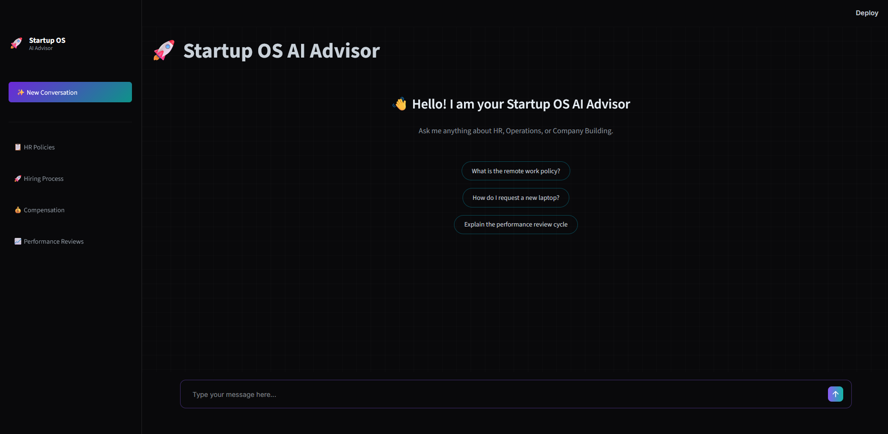
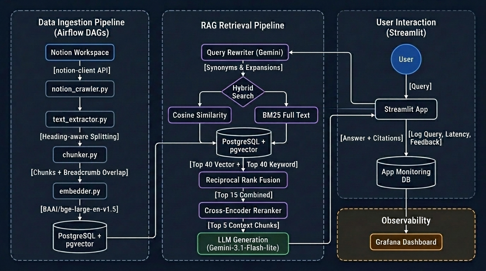
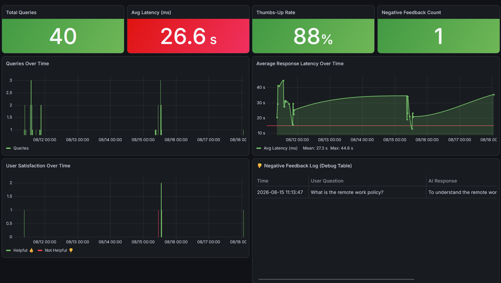

# Startup OS AI Advisor 🚀

<p align="center">
  <!-- Core -->
  
  
  <!-- LLM & AI -->
  
  
  
  <br/>
  <!-- Data & DB -->
  
  
  <!-- Pipeline & Infra -->
  
  
  
  <br/>
  <!-- UI & Monitoring -->
  
  
  <!-- RAG -->
  
  
</p>

An AI-powered virtual Co-founder and HR Operations Advisor that answers questions about company building, HR practices, and startup operations by querying a private Notion knowledge base via a highly optimized Retrieval-Augmented Generation (RAG) pipeline.

---

## 🎯 Problem Statement

### Target Audience
* **First-time Founders & C-Levels:** Managers at scale-up startups facing critical organizational decisions.
* **HR / People Operations Managers:** Professionals responsible for culture, compensation, and performance frameworks.
* **Team Leads:** Middle managers learning how to lead teams, resolve conflicts, or manage underperformance.

### The Pain Points
In the chaotic environment of a growing startup, leaders constantly face high-stakes "first-time" challenges (e.g., distributing equity, firing a toxic high-performer, setting up performance reviews). 
1. **Time & Resource Constraints:** Founders do not have the time to read a 500-page management book or click through dozens of nested Notion wiki pages to find a specific framework.
2. **Generic AI Limitations:** Standard LLMs provide superficial, generic advice lacking proven, battle-tested management frameworks.
3. **High Consulting Costs:** Hiring HR or Operations consultants to set up basic company frameworks is prohibitively expensive for early-stage startups.

---

## 💡 The Solution & Demo

**Startup OS AI Advisor** solves this by ingesting the comprehensive, battle-tested knowledge from *The Company Building Handbook* (a complex, hierarchically structured Notion database). 

Users can chat with the agent to get step-by-step guidance, exact frameworks, and practical templates instantly, with responses grounded strictly in the source material.

### Core Use Cases

* **Use Case 1 (Crisis Management):** 
  * *Query:* "A top-performing sales rep is generating the most revenue but has a toxic attitude and violates company culture. What should I do?"
* **Use Case 2 (Process Setup):** 
  * *Query:* "We just hit 20 employees and need to set up our first Performance Review process. Where do we start and what are the exact steps?"
* **Use Case 3 (Organizational Structure & Comp):** 
  * *Query:* "Explain the difference between offering ESOP (Equity) versus Profit Sharing for middle managers."

<video src="medias/Chat_Interface_demo.mp4" controls width="100%"></video>



---

## ⚙️ Setup & Run Instructions

### 🐳 Running Locally via Docker Compose

#### Step 1 — Prepare Your Notion Knowledge Base

The system crawls a **Notion page** (and all its sub-pages) as the knowledge base. You need to:

1. **Duplicate the source handbook to your own Notion workspace:**
   - Open [The Company Building Handbook](https://www.notion.so/) (or any Notion page you want to use)
   - Click the `•••` menu (top-right) → **"Duplicate"** → choose your personal workspace
   - Wait for the duplication to finish — all nested sub-pages will be copied

2. **Create a Notion Integration (Internal):**
   - Go to [https://www.notion.so/profile/integrations](https://www.notion.so/profile/integrations)
   - Click **"New integration"** → give it a name (e.g. `startup-os-crawler`)
   - Set type to **"Internal"**, select your workspace → click **"Save"**
   - Copy the **"Internal Integration Secret"** — this is your `NOTION_API_KEY`

3. **Connect the Integration to your page:**
   - Open the duplicated Notion page (the root page)
   - Click `•••` (top-right) → **"Connect to"** → search and select your integration
   - ⚠️ You only need to connect to the **root page** — all sub-pages inherit access automatically

4. **Get the Root Page ID:**
   - Open the root Notion page in your browser
   - Copy the last part of the URL: `https://www.notion.so/Your-Page-Title-`**`48f392a1a551836795f9010caa84da89`**
   - The 32-character hex string is your `NOTION_ROOT_PAGE_ID`

#### Step 2 — Clone & Configure

```bash
git clone <repo_url>
cd startup-os-ai-advisor
```

Copy `.env.example` to `.env` and fill in your keys:

```env
# ── Notion API ──────────────────────────────────────────────
NOTION_API_KEY=secret_xxxxxxxxxxxxxxxxxxxxxxxxxxxxxxxxxxxx
NOTION_ROOT_PAGE_ID=48f392a1a551836795f9010caa84da89   # 32-char hex from URL

# ── LLM API ─────────────────────────────────────────────────
GEMINI_API_KEY=AIzaSy...

# ── PostgreSQL ───────────────────────────────────────────────
POSTGRES_HOST=postgres
POSTGRES_PORT=5432
POSTGRES_DB=startup_os
POSTGRES_USER=postgres
POSTGRES_PASSWORD=postgres

# ── Airflow ──────────────────────────────────────────────────
# Must match your host user UID to avoid volume permission errors
# Run the command below and paste the output here:
#   id -u
AIRFLOW_UID=1000

# ── Email Alerts (optional) ──────────────────────────────────
ALERT_EMAIL=admin@example.com
SMTP_HOST=smtp.gmail.com
SMTP_PORT=587
SMTP_USER=dummy
SMTP_PASSWORD=dummy
```

#### Step 3 — Start the System

> **First run:** Docker needs to build the Airflow and Streamlit images (~3–5 minutes).

```bash
docker compose up -d --build
```

> **Subsequent runs** (images already built):
```bash
docker compose up -d
```

Wait ~30 seconds for PostgreSQL to initialize, then verify all containers are running:

```bash
docker compose ps
```

All 5 services should show `Up`: `postgres`, `airflow`, `streamlit`, `grafana`, `pgadmin`.

#### Step 4 — Ingest Data

1. Open **Airflow** at `http://localhost:8080` → login: `admin` / `admin`
2. Enable and trigger **`01_notion_extraction`** → wait for it to complete (✅ green)
3. DAG 01 will automatically chain-trigger **`02_notion_transform_load`** if there are new pages

> ⏱️ DAG 02 downloads the ONNX embedding model (~1.2 GB) on first run — allow 5–10 minutes.

#### 🔄 Incremental Ingestion (Deduplication & Change Detection)

The pipeline is designed to run on a **daily schedule** (`@daily`) without re-processing unchanged content. Here's how it works under the hood:

**DAG 01 — Extraction (`01_notion_extraction`)**

```
Notion API crawl (all pages)
       ↓
Compare each page's last_edited timestamp vs PostgreSQL DB state
       ↓
  Changed?  ──No──→  Skip (log "N unchanged, skipped")
     │
    Yes
     ↓
Serialize only changed pages → Bronze JSON file
(data/bronze/crawled_pages_YYYY-MM-DD.json)
       ↓
Push filename via XCom → auto-trigger DAG 02
```

- If **nothing changed**: no bronze file is written, DAG 02 is **not triggered** — avoids unnecessary embedding cost.
- Each bronze file is dated (`crawled_pages_YYYY-MM-DD.json`) so concurrent runs never overwrite each other.

**DAG 02 — Transform & Load (`02_notion_transform_load`)**

```
Read bronze file
       ↓
For each changed page:
  1. upsert_document()  → update metadata in `documents` table
  2. delete_chunks_for_document()  → remove all old chunks for that page
  3. chunk_page()  → re-chunk with current config
  4. embed_chunks()  → re-embed with current model
  5. insert_chunks()  → insert fresh chunks + vectors
  6. DELETE bronze file  ← only on success
```

- **Old chunks are deleted before re-inserting** → no duplicate vectors in the database.
- If a page fails mid-processing, the bronze file is **kept on disk** (not deleted), so the next DAG run automatically picks it up and retries — without needing to re-crawl Notion.
- DAG 02 also scans for **any leftover bronze files** from previous failed runs and processes them all in one batch.

#### 📧 Email Alerts on Ingestion Failure

Both DAGs are configured with `email_on_failure: True`. When any task fails, Airflow sends an alert to `ALERT_EMAIL`. To enable real email delivery:

1. **Generate a Gmail App Password** (required — regular passwords are rejected by Google):
   - Go to [https://myaccount.google.com/apppasswords](https://myaccount.google.com/apppasswords)
   - Select app: **"Mail"** → device: **"Other"** → click Generate
   - Copy the 16-character password

2. **Update your `.env`:**
   ```env
   ALERT_EMAIL=your.email@gmail.com
   SMTP_HOST=smtp.gmail.com
   SMTP_PORT=587
   SMTP_USER=your.email@gmail.com
   SMTP_PASSWORD=xxxx xxxx xxxx xxxx   # 16-char App Password (no spaces)
   ```

3. Restart the Airflow container to apply:
   ```bash
   docker compose restart airflow
   ```

> ℹ️ To **disable email alerts**, leave `SMTP_USER=dummy` and `SMTP_PASSWORD=dummy` in `.env` — Airflow will silently skip delivery without crashing.

#### Step 5 — Access the Services

| Service | URL | Login |
|---|---|---|
| **Streamlit Chat UI** | `http://localhost:8501` | — |
| **Airflow** | `http://localhost:8080` | `admin` / `admin` |
| **Grafana Dashboard** | `http://localhost:3000` | `admin` / `admin` |
| **pgAdmin** | `http://localhost:5050` | `admin@admin.com` / `admin` |

> **All dependency versions are pinned** in `uv.lock`. Run `uv sync` to reproduce the exact Python environment outside Docker.

### ☁️ Cloud Deployment (AWS EC2)

1. Provision an **AWS EC2 Ubuntu Instance** (t3.medium or higher — 8GB RAM required for the local ONNX Reranker).
2. Attach an **Elastic IP** and configure Security Group inbound rules:
   - `Port 8501` (Streamlit)
   - `Port 3000` (Grafana)
3. SSH into the instance, install Docker and Git.
4. Clone the repository, add `.env`, and run `docker compose up -d`.
5. Access publicly via `http://<EC2_PUBLIC_IP>:8501`.

---

## 🛠️ Technology Stack

| Category | Tool | Purpose |
|---|---|---|
| **Environment** | `uv` (Python 3.12+) | Dependency management with pinned `uv.lock` |
| **Data Source** | Notion API (`notion-client`) | Recursive hierarchical crawling of knowledge base |
| **Ingestion Pipeline** | Apache Airflow (Dockerized DAGs) | **Fully automated** extract → chunk → embed → load |
| **Vector Database** | PostgreSQL + `pgvector` | Stores 1024-dim embeddings + full-text BM25 via `tsvector` |
| **Embedding Model** | `BAAI/bge-large-en-v1.5` (ONNX via `fastembed`) | Local inference, no API cost, dim=1024 |
| **Retrieval** | Native Python (BM25 + Cosine + RRF) | Hybrid search with weighted Reciprocal Rank Fusion |
| **Re-ranking** | `BAAI/bge-reranker-base` (ONNX via `fastembed`) | Cross-Encoder reranker, Top-40 → Top-5 |
| **LLM Generation** | Google Gemini `gemini-3.1-flash-lite` | Answer generation via OpenAI-compatible SDK |
| **User Interface** | Streamlit | Chat UI with citations, thumbs up/down feedback |
| **Monitoring** | Grafana (connected to PostgreSQL) | Real-time dashboard with 5 charts |
| **Deployment** | Docker Compose + AWS EC2 | Full containerized cloud deployment |

---

## 🏗️ System Architecture



The system has two independent pipelines:
1. **Ingestion (offline):** Airflow DAGs crawl Notion → chunk → embed → load into PostgreSQL. *(see [§ Data Ingestion Pipeline](#-data-ingestion-pipeline) below)*
2. **Retrieval (online):** User query → rewrite → Hybrid Search → RRF → rerank → Top-5 chunks → LLM → answer. *(see [§ Retrieval Pipeline](#-retrieval-pipeline-online) below)*
3. **Logging:** Every interaction is logged to `app_monitoring_logs` for Grafana.

---

## 🔄 Data Ingestion Pipeline

The ingestion pipeline runs **offline** via two chained Apache Airflow DAGs. It is designed for **incremental updates** — only pages that have changed in Notion since the last run are re-processed.

### Stage 1 — Notion Crawling (`notion_crawler.py`)

- Starts from `NOTION_ROOT_PAGE_ID` and **recursively** traverses all child pages via the Notion API
- Handles pagination and rate-limit retries automatically
- Builds a **hierarchical breadcrumb** for each page (e.g. `Handbook > HR > Performance Reviews`)
- Compares each page's `last_edited` timestamp against the PostgreSQL DB state → **skips unchanged pages**
- Serializes only changed pages to a dated Bronze JSON file: `data/bronze/crawled_pages_YYYY-MM-DD.json`

### Stage 2 — Text Extraction (`text_extractor.py`)

- Converts raw Notion block objects into clean plain text
- Preserves heading structure and list formatting for downstream chunking

### Stage 3 — Heading-Aware Chunking (`chunker.py`)

- Splits pages into chunks of max **512 tokens** using heading boundaries as natural split points
- Adds **64-token sliding window overlap** between paragraph sub-chunks to prevent context loss at boundaries
- Each chunk gets a **contextual breadcrumb prefix** prepended to its embed text:
  ```
  [Document: Company Handbook | Path: HR > Performance Reviews]
  <chunk content here...>
  ```
  This prefix is used for embedding and BM25 indexing only — the raw content is stored separately for display.

### Stage 4 — Embedding (`embedder.py`)

- Batch-embeds chunks using `BAAI/bge-large-en-v1.5` (1024-dim) via **FastEmbed ONNX** (local, no API cost)
- The ONNX model is cached in `data/.model_cache/` and persists across container restarts

### Stage 5 — Load to PostgreSQL (`loader.py`)

- **`upsert_document()`** — updates metadata in the `documents` table
- **`delete_chunks_for_document()`** — removes all existing chunks for the page (prevents duplicates)
- **`insert_chunks()`** — inserts fresh chunks with their 1024-dim vector embeddings
- A `GENERATED ALWAYS AS` column auto-builds the `tsvector` index for BM25 on insert
- Uses **exact SeqScan** (no IVFFlat/HNSW index) — at ~1,200 chunks, this gives 100% recall in <1ms

### Change Detection & Retry Safety

```
DAG 01 runs @daily
  → No changes detected  →  exit cleanly (no embedding cost)
  → Changes found        →  write Bronze file → trigger DAG 02

DAG 02 per Bronze file
  → Success  →  delete Bronze file
  → Failure  →  keep Bronze file on disk (auto-retried next run)
               + also picks up any leftover files from previous failures
               + sends email alert to ALERT_EMAIL
```

---

## 🔍 Retrieval Pipeline (Online)

Implemented in [`retrieval/rag_base.py`](retrieval/rag_base.py) as a singleton class (`RAGBase`) loaded once at app startup to avoid reloading the Cross-Encoder on every request.

**Step 1 — Query Rewriting** (Gemini `gemini-3.1-flash-lite`)

The raw user query is sent to Gemini with a domain-aware system prompt that instructs it to:
- Expand abbreviations (`esop` → `Employee Stock Ownership Plan`)
- Add domain synonyms (`fire` → `termination, dismissal, employee separation`)
- Fix typos and reformulate for better vector + BM25 coverage

**Step 2 — Query Embedding** (FastEmbed ONNX, local)

The rewritten query is embedded using the same `BAAI/bge-large-en-v1.5` model as the knowledge base chunks, producing a 1024-dim vector.

**Step 3 — Hybrid Search** (PostgreSQL)

Two parallel searches run against the `chunks` table:
- **Vector search:** cosine similarity via `pgvector` (`<=>` operator), Top-`RETRIEVAL_TOP_K` results
- **BM25 search:** `ts_rank()` on the auto-generated `tsvector` column (includes breadcrumb + heading + content), Top-`RETRIEVAL_TOP_K` results

Results are merged via **Weighted RRF**: `score = (0.75 × 1/(k+rank_vector)) + (0.25 × 1/(k+rank_bm25))`

**Step 4 — Cross-Encoder Reranking** (`BAAI/bge-reranker-base` via `sentence-transformers`)

The merged Top-40 candidates are re-scored by a Cross-Encoder that evaluates each `(query, chunk)` pair jointly — capturing fine-grained relevance beyond embedding similarity. Only the Top-5 highest-scoring chunks are passed to the LLM.

> ⚠️ The Cross-Encoder requires ~500MB RAM. On memory-constrained machines, initialize `RAGBase(use_reranker=False)` to skip reranking (faster, lower quality).

**Step 5 — Answer Generation** (Gemini `gemini-3.1-flash-lite`)

The Top-5 chunks + rewritten query are assembled into a grounded prompt. The LLM is instructed to:
- Answer **only** from the provided context (no external knowledge)
- Cite the source breadcrumb for each claim
- Return "I don't know" if the context is insufficient

**Step 6 — Logging** (`ui/logger.py`)

Every interaction is persisted to PostgreSQL `app_monitoring_logs` with:
- `user_query`, `rewritten_query`, `retrieved_chunks` (chunk IDs array), `llm_response`, `latency_ms`
- `rating` — updated asynchronously when the user clicks 👍 (+1) or 👎 (-1)

## ✨ Best Practices Implemented

> These three techniques go beyond basic RAG and are explicitly evaluated in the retrieval benchmarks above.

### ✅ Hybrid Search (BM25 + Vector + RRF)
The retrieval pipeline combines:
- **Vector search** (cosine similarity via `pgvector`) — captures semantic meaning
- **BM25 full-text search** (via PostgreSQL `tsvector`) — captures exact keyword matches
- **Reciprocal Rank Fusion** with weighted formula `(0.75 × Vector) + (0.25 × BM25)`

See [`retrieval/`](retrieval/) for implementation.

### ✅ Document Re-ranking (Cross-Encoder)
After retrieval, a `BAAI/bge-reranker-base` Cross-Encoder model re-scores the Top-40 candidates and retains only the Top-5 most relevant chunks for the LLM prompt.

**Impact:** Lifts Hit@1 from **0.587 → 0.680** (+15.8% relative improvement).

### ✅ User Query Rewriting
Before retrieval, the user query is sent to `gemini-3.1-flash-lite` to expand it with synonyms and related terms, improving recall for queries that use different terminology than the knowledge base.

**Example:** *"How do I fire someone?"* → expanded to include *"termination", "dismissal", "letting go", "employee separation"*, etc.

---

## 📈 Evaluation Results & Optimization Journey

We generated a synthetic ground truth dataset of **300 Q&A pairs** (3 questions × 100 random document chunks) using `gemini-3.1-flash-lite`. Evaluation scripts are in [`evaluation/`](evaluation/).

### Running the Evaluations

```bash
# Step 1 (one-time): Generate synthetic ground truth (~9 min, 100 LLM calls)
uv run python -m evaluation.run_evaluation --generate

# Step 2: Run full evaluation (retrieval + LLM judge on 50 samples)
uv run python -m evaluation.run_evaluation

# Retrieval-only (faster, skips Gemini-as-a-judge)
uv run python -m evaluation.run_evaluation --skip-llm-eval

# Run RRF grid search (31 combinations)
uv run python -m evaluation.rrf_grid_search
```

Results are saved to `evaluation/results/`.

### Retrieval Evaluation

Three retrieval strategies were evaluated and compared to select the best approach:

| Strategy | Hit@1 | Hit@3 | Hit@5 | Hit@10 | MRR@5 | MRR@10 |
|---|---|---|---|---|---|---|
| `vector_only` | 0.583 | 0.723 | 0.793 | 0.860 | 0.663 | 0.672 |
| `hybrid` | 0.587 | 0.727 | 0.793 | 0.860 | 0.666 | 0.675 |
| ✅ **`hybrid_reranker`** | **0.680** | **0.803** | **0.843** | **0.843** | **0.748** | **0.748** |

**→ Selected strategy:** `hybrid_reranker` — **84.3% Hit@5**, best across all metrics. This strategy is used in production.

### RRF Hyperparameter Grid Search

To find the optimal RRF configuration, we ran a grid search over **31 combinations** of `k_rrf` ∈ {5, 10, 20, 40, 60} and weight ratios `w_vector` / `w_bm25`. Key results (sorted by MRR@10 descending):

| k_rrf | w_vector | w_bm25 | Hit@1 | Hit@5 | MRR@5 | MRR@10 | Time (s) |
|---|---|---|---|---|---|---|---|
| 10 | **0.75** | **0.25** | 0.587 | 0.793 | 0.666 | 0.675 | 6.7 |
| 20 | 0.75 | 0.25 | 0.587 | 0.793 | 0.666 | 0.675 | 6.9 |
| 40 | 0.75 | 0.25 | 0.587 | 0.793 | 0.666 | 0.675 | 6.7 |
| 60 | 0.75 | 0.25 | 0.587 | 0.793 | 0.666 | 0.675 | 6.6 |
| 40 | 0.60 | 0.40 | 0.587 | 0.793 | 0.666 | 0.675 | 6.6 |
| 10 | 0.85 | 0.15 | 0.583 | 0.793 | 0.664 | 0.673 | 6.9 |
| 5 | 0.75 | 0.25 | 0.583 | 0.793 | 0.665 | 0.674 | 6.6 |
| 5 | 1.00 | 0.00 | 0.583 | 0.793 | 0.663 | 0.672 | 6.7 |
| 10 | 0.50 | 0.50 | 0.580 | 0.793 | 0.663 | 0.672 | 6.8 |
| 10 | 0.90 | 0.10 | 0.580 | 0.793 | 0.662 | 0.671 | 6.7 |

**Findings:**
- **Hit@5 is stable at 0.793** across almost all configurations — the RRF formula has minimal impact at this recall level since the reranker does the heavy lifting.
- **MRR@1 (precision at top-1) is more sensitive** to the weight ratio. `w_vector=0.75` / `w_bm25=0.25` consistently yields the highest MRR@10.
- **`k_rrf` has negligible effect** beyond k=10 — larger windows don't improve recall at our dataset scale.
- **→ Chosen config:** `k_rrf=60`, `w_vector=0.75`, `w_bm25=0.25` (best MRR@10, stable Hit@5).

Full grid search data: [`evaluation/results/rrf_grid_search.json`](evaluation/results/rrf_grid_search.json)

### LLM Quality Evaluation

Using **Gemini-as-a-judge** on **50 randomly sampled** query-response pairs from the `hybrid_reranker` pipeline:

| Metric | Score | Description |
|---|---|---|
| **Avg Faithfulness** | **5.00 / 5.0** | Is the answer fully grounded in the retrieved context? (no hallucinations) |
| **Avg Answer Relevance** | **5.00 / 5.0** | Does the answer directly address the user's question? |
| **Samples evaluated** | 50 | — |

**Conclusion:** LLM generation is **perfect** — all 50 answers are fully grounded in the source material with zero hallucinations detected. Full per-sample results are in [`evaluation/results/eval_report.md`](evaluation/results/eval_report.md).

### Initial Baseline & Root Cause Analysis

The first evaluation run scored only **21.3% Hit@5** due to multiple stacked issues:

* ❌ **[Primary] IVFFlat index with `probes=1` (default):** An IVFFlat approximate index was active on the `chunks` table. With `probes=1`, pgvector only scans 1 cluster out of N during ANN search, **hard-capping recall at ~17%**. Fix: dropped the index entirely — at ~1,200 chunks, exact SeqScan runs in <1ms with 100% recall.
* ❌ **Wrong embedding model:** `paraphrase-multilingual-mpnet-base-v2` is optimized for multilingual paraphrase, not domain-specific English HR/management content.
* ❌ **Lower dimension (768d):** Less representational capacity vs 1024d models.
* ❌ **No contextual breadcrumbs:** Isolated chunks lacked hierarchical context (e.g., *"Set it to 3 months"* with no reference to what *"it"* is).
* ❌ **Pure vector search only:** No BM25 keyword fallback for exact-match terminology.
* ❌ **No reranking:** Top-K passed directly to LLM without cross-encoder validation.

### Optimization Steps Applied

1. **Dropped IVFFlat index** → exact SeqScan (100% recall, <1ms at this scale).
2. **Switched embedding model** → `BAAI/bge-large-en-v1.5` (1024d, MTEB-optimized for English).
3. **Added contextual breadcrumbs** → hierarchical prefix `[Document: X | Path: Y]` in each chunk's embed text.
4. **Sliding window overlap** → 64-token overlap between paragraph sub-chunks.
5. **BM25 schema tuning** → indexes breadcrumbs + headings, not just raw content.
6. **Weighted RRF** → `(0.75 × Vector) + (0.25 × BM25)`.

---

## 📊 Monitoring & Observability

Every query, LLM response, retrieval latency, and user feedback (👍 / 👎) is logged to the PostgreSQL `app_monitoring_logs` table. Grafana is connected directly to PostgreSQL and visualizes metrics in real-time.

**The Grafana dashboard includes 8 panels:**

*Overview Metrics:*
1. 🔢 **Total Queries** — Total number of interactions processed
2. ⏱️ **Avg Latency (ms)** — Average end-to-end response time across all queries
3. 👍 **Thumbs-Up Rate** — Percentage of positive user feedback
4. ⚠️ **Negative Feedback Count** — Total number of thumbs-down ratings

*Detailed Charts & Tables:*
5. 📈 **Queries Over Time** — Request volume trend by time window
6. 📉 **Average Response Latency Over Time** — End-to-end latency fluctuation trend
7. 💚 **User Satisfaction Over Time** — Helpful vs. Not Helpful ratings tracked chronologically
8. 📋 **Negative Feedback Log** — Table view of exact user queries and AI responses for thumbs-down ratings (useful for debugging)



---

## 🗄️ Database Schema & Migration

The PostgreSQL schema is initialized automatically by `loader.py` on first DAG run (`init_schema()`). It creates:

| Table | Purpose |
|---|---|
| `documents` | One row per Notion page — stores `page_id`, `title`, `breadcrumb`, `last_edited` |
| `chunks` | One row per text chunk — stores `content`, `embed_text` (with breadcrumb prefix), `embedding` (vector 1024), `tsv` (auto-generated tsvector for BM25) |
| `app_monitoring_logs` | One row per user interaction — stores query, rewritten query, chunk IDs, LLM response, latency, and 👍/👎 rating |

### Switching Embedding Models

If you change the embedding model (e.g., 768d → 1024d), the vector dimension changes and existing chunks become incompatible. Run the migration script to drop and recreate the `chunks` table:

```bash
docker compose exec airflow uv run python -m scripts.migrate_schema
```

> ⚠️ **Warning:** This deletes all stored chunks. Re-run the full ingestion pipeline (`01_notion_extraction` → `02_notion_transform_load`) afterwards.

## 🚧 Known Issues & Future Improvements

### 🐢 Initial Load Speed & Reranker Latency
**Symptoms:** 
- The very first query (Cold Start) after starting the Streamlit app takes up to 10 seconds.
- Even on subsequent queries, retrieval takes a few seconds, which is slower than expected.

**Why it happens (Root Cause Analysis):**
1. **PyTorch vs. ONNX Discrepancy:** While this README and `config.py` state that the Cross-Encoder Reranker (`bge-reranker-base`) uses ONNX via `fastembed`, the actual implementation in `retrieval/rag_base.py` uses `sentence-transformers` (PyTorch). PyTorch has a massive initialization overhead (~2s just to import) and loading a 500MB model into memory on CPU is slow.
2. **CPU Inference Bottleneck:** PyTorch CPU inference for reranking up to 40 chunks per query is significantly slower than ONNX Runtime.
3. **Streamlit Thread Blocking:** `RAGBase` initialization (and its built-in warmup script) runs synchronously on the main Streamlit thread during the first user's visit. This blocks the UI entirely until the PyTorch model finishes loading.

**Future Improvements (Action Plan):**
1. **Migrate Reranker to FastEmbed (ONNX):** Refactor `retrieval/rag_base.py` to replace `sentence-transformers` with `fastembed.TextCrossEncoder`. This will dramatically reduce both cold-start initialization time and per-query CPU inference latency.
2. **Decouple API (FastAPI):** Move the entire `RAGBase` logic out of Streamlit and into a dedicated FastAPI backend service. The models can stay resident in memory independently of Streamlit's lifecycle, eliminating cold starts when the UI reloads.

---

*Built by Phan Nguyen*
